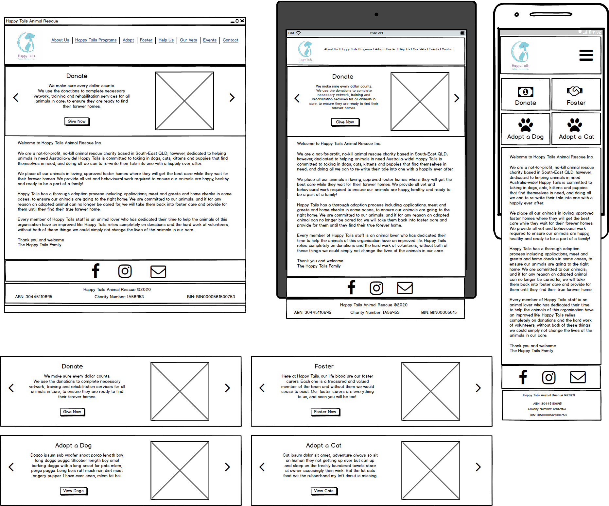
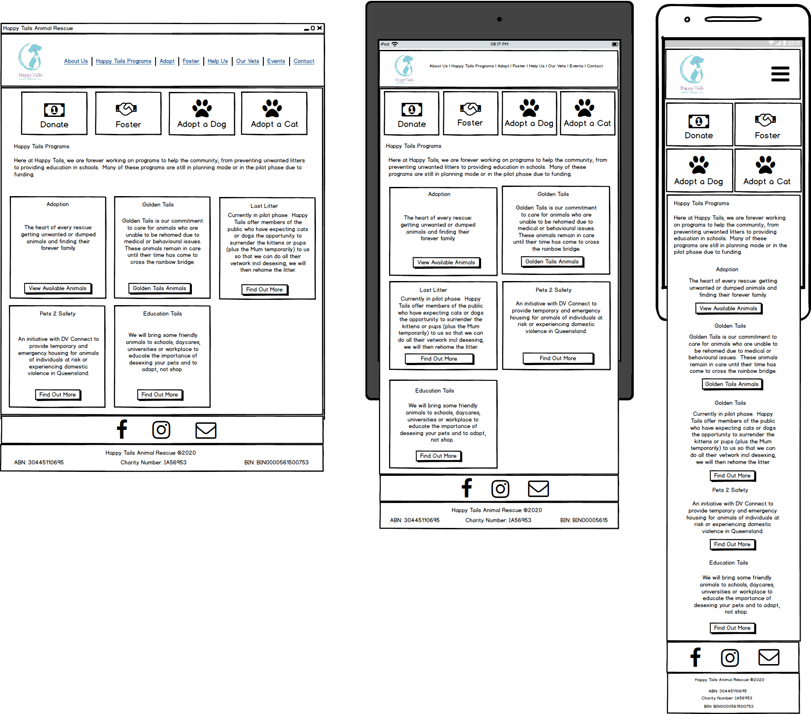
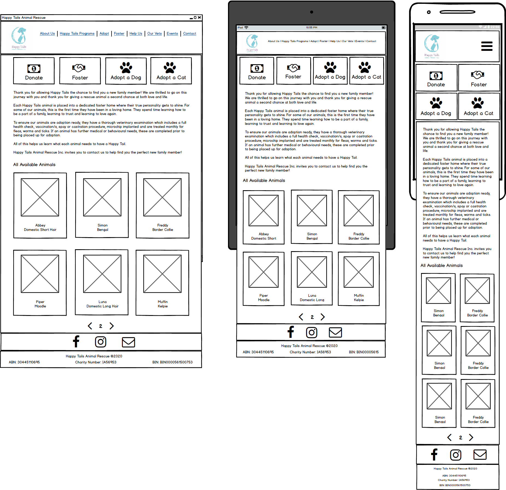
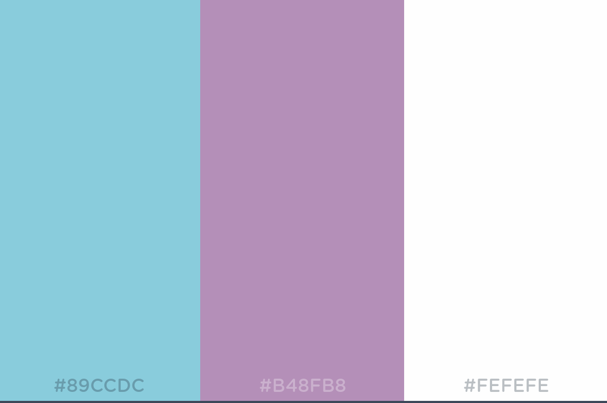
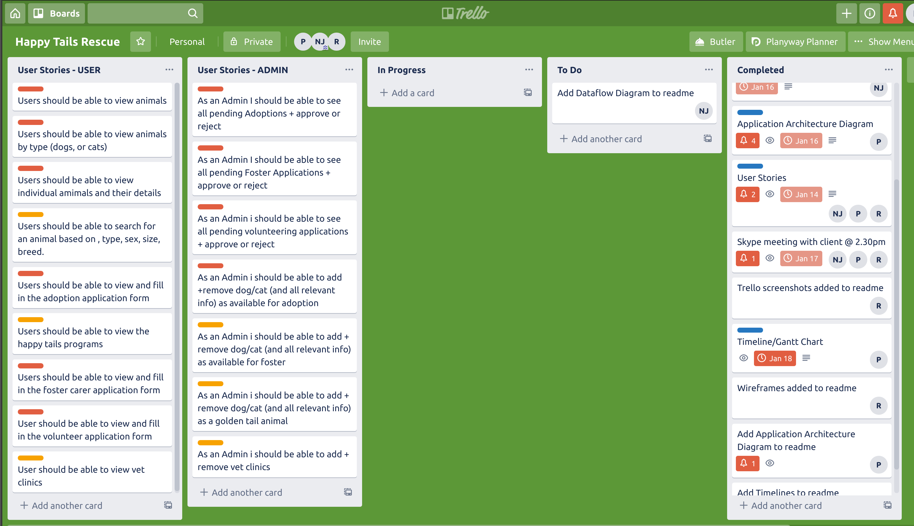
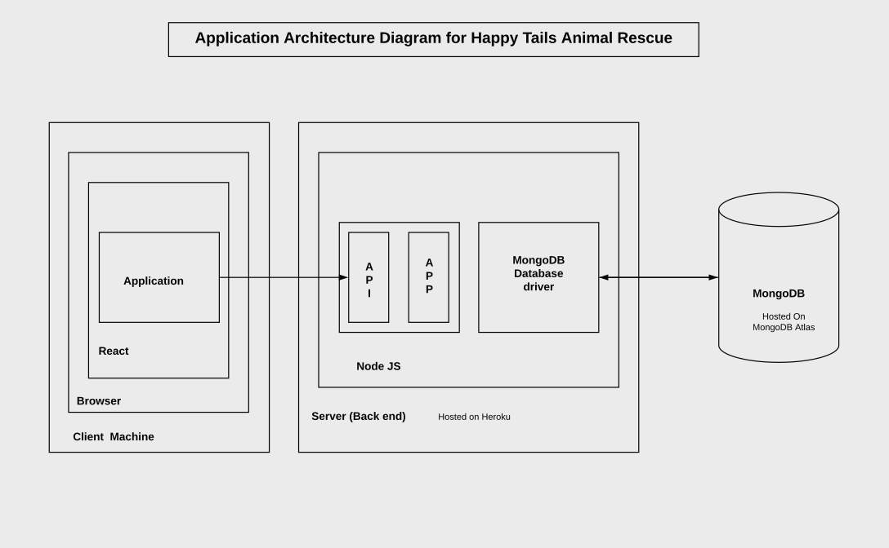
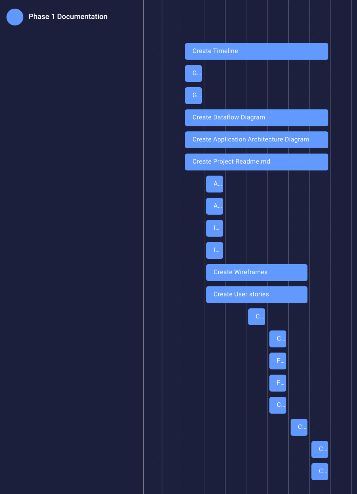
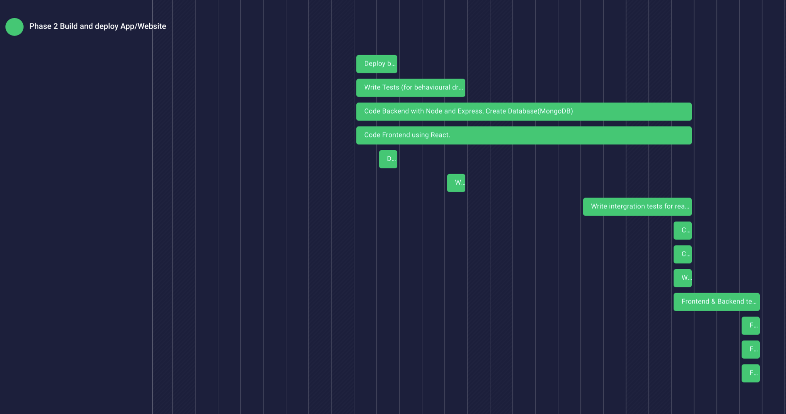
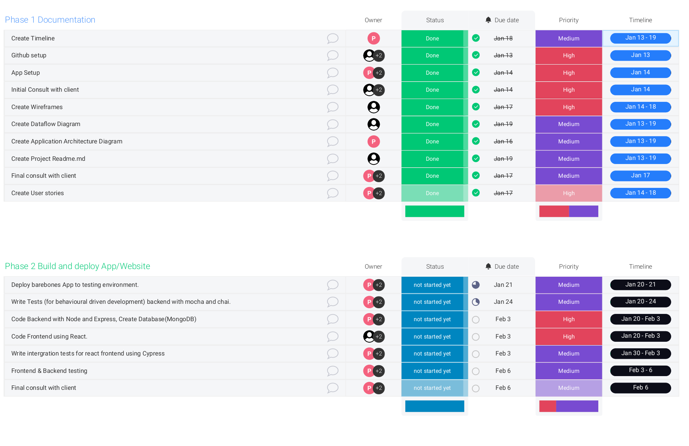

# Purpose
The purpose of this application is to provide the client (Happy Tails Animal Rescue) with a modern and responsive website. The client already had a website made by a volunteer with WordPress however this was not updated regularly, links were broken, the website rendered slowly and had many unnecessary pages. The website also no longer had listings of available animals that are available for adoption. The client agreed that this should be the main purpose of the website.

The new website would contain information on the organisation, available adoptable animals and available foster animals (including all relevant info on the animal). It will also contain information on recommended vet clinics and donations. The website has many community outreach projects named 'Happy Tails programs' including: 

Golden Tails - Golden Tails is our commitment to care for animals who are unable to be rehomed due to medical or behavioral issues.  These animals remain in care until their time has come to cross the rainbow bridge.

Last Litter - Happy Tails offer members of the public who have expecting cats or dogs the opportunity to surrender the kittens or pups (plus the Mum temporarily) to us so that we can do all their vet work incl desexing, we will then rehome the litter.

Pets 2 Safety - An initiative with DV Connect to provide temporary and emergency housing for animals of individuals at risk or experiencing domestic violence in Queensland

Education Tails - We will bring some friendly animals to schools, daycares, universities or workplace to educate the importance of desexing your pets and to adopt, not shop. 

Rehoming Assistance - Assistance for owners needing to rehome their animals.

The forms for adoption, fostering, volunteering, surrendering an animal are also available on the website. The client expressed concerns with the ease and useability of the website. We will try to make it as user friendly as possible. 

# Functionality / features

Guests can
* Read the organisations profile
* View Happy Tails programs
* View all available animals (All animals or by type)
* Filter animals listing by gender, age, breed, etc
* View an individual animal's details (including medical notes, description, price, weight, etc) with link to view on petrescue.com
* View and fill in an adoption application form (forms are validated and show errors before sending)
* View and fill in a request to be a foster carer application form (forms are validated and show errors before sending)
* View and fill in a request to be a volunteer application form (forms are validated and show errors before sending)
* View recommended vet clinics and follow links to visit the vets site

Admin can (when signed in and authorised through email and password)
* See all pending adoptions and approve or reject applications
* See all pending foster requests and approve or reject applications
* See all pending volunteering and approve or reject applications
* Add/remove/edit dogs/cats (and all relevant info) as available for adoption
* Add/remove/edit dog/cat (and all relevant info) as available for foster
* Add/remove/edit dog/cat (and all relevant info) as Golden Tails animals
* Add/remove/edit vet clinics

# Target audience

The main target audience for this web application would be people wishing to adopt a dog or cat, foster an animal or volunteer with the organisation. 

# Tech stack
* HTML/CSS for visual styling the user interface through style components/emotion
* Heroku for hosting the server application
* Netlify hosting for client side
* NodeJS as Javascript runtime environment
* ExpressJS open source framework for creating the server application on NodeJS
* ReactJS framework for creating the client side application that handles page routing, page rendering, searching
* MongoDB and MongoAtlas for the animals database hosted on the cloud

# Wireframes
Made using Balsamiq for desktop, tablet and mobile.

Made using Figma (using only mobile view as this will be the most popular way to view) to give the overall flow and design of the website including color palette. 

# Trello
We used Trello to map out what was needed for the application. We broke down the features/functionality and assigned them to either 'MVP' or 'Nice to have'. These were further broken down the 'Guest' or 'Admin'. 

Trello was further used to assign the documentation tasks to team members. We chose which of the items to compete then moved them from 'To Do' then 'In Progress' while we completed them and lastly to 'Complete' when they were finished. We have a group GitHub were we each have a copy on our local and we would push to a branch of the forked repo and then create a pull request to merge with the master.

# Application Architecture Diagram

### Project Timeline Part 1(documentation)

# Data Flow Diagram

# Deployed Website

# GitHub Server
https://github.com/NicolasJJensen/happy_tails_rescue

# GitHub Client
https://github.com/NicolasJJensen/happy_tails_rescue_client

# Client and User Logs

Issue: Home was a unessessary page
Solution: About Us has became the Home page

Issue: Blue headers links are only available as clickable
Solution: Made the blue, words and symbol clickable 

Issue: Some adopt form input fields are too small
Solution: Changed these fields from input to text box 

Issue: Adopt form is long and cumbersome to go through
Solution: Split form into manageable sections to allow for a more user friendly experience

Issue: Programs had short over view then the main description further down the page, was difficult to navigate
Solution: Moved overview and description together

Issue: Email addresses were overflowing the screen size on mobile
Solution: Mobile font is smaller to fit email addresses in the screen size

Issue: Symbols for social links were too small on mobile
Solution: Made symbols larger to allow for ease on a mobile device

Issue: Footer text should stack in mobile view
Solution: Stacked text in mobile view

Issue: Chosen color for buttons was too dark (#B48FB8)
Solution: Chose a lighter color for ease of viewing (#CBB0CE)

Issue: Single animal view format difficult to read in tablet and mobile view
Solution: Stack sections in a centred column for mobile and tablet view

Carousel mobile/desktop
Issue: Photo scroller too large for mobile view
Solution: Scale photo scroller by 50% for mobile,
Issue: Carousel loads as odd sizes
Solution: Set min width for img,
Issue: Previous solution breaks mobile carousel
Solution: Set different mins for mobile 

# Task Delagation

## Renee
### Strength
* MongoDB 
* Express
* HTML
* SCSS
#### Weakness
* React
### Tasks
Inital set up of server
* Express routes for animals
* Animal schema
* Set up seeds with animals and text for dynamic text pages
* Dynamic text schema
* Animal controller

Further set up of server
* Adoption form schema
* Routes for dynamic text pages
* Refactor seeds for dynamic text pages
* Refactor schema for dynamic text pages

Client setup
* Axios setup for text and animals
* Display dynamic text of each page
* Add an animal form and input/textarea/select
* Add banner to welcome
* Adoption for animal form and input/textarea/select
* Single animal view text and layout
* Add link buttons where needed
* Link FaceBook and Instagram to footer
* Create blue top button links

Cypress Tesing
* Adoption form
* View animal
* API
* Header/footer links
* Program links
* Vet links

## Pete
### Strength
* Logic
* HTML
* SCSS
#### Weakness
* React
* Express

## Nic
### Strength
* Logic
* React
* Programming Systems
* Manipulating Data
#### Weakness
* Deployment
* Express
